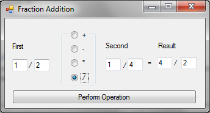
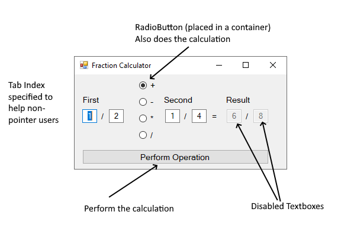

# See course shell for due date.

Zip your entire project and upload to the correct folder (You will be
required to do this for the rest of the submissions in this semester as
well as the final examination).

You must add the partial implementation of the Fraction class to your
project by copying and pasting the statement from the appendix to the
new class.

The Fraction Calculator GUI

This is a simple non-usable app. It demonstrates some useful gui
concepts such as completing a task in more than one way, preventing user
input errors, allowing the user to work the app without a pointer.

### Additional logic required by the Fraction Class

1.  Another constructor that takes string arguments instead of ints.

2.  Add two methods that will overload the **\*** and **/** arithmetic
    operators.

### Functionalities/Features required by the Application.

#### Design

Your form must look and feel like normal application. Buttons are meant
to be clicked, and Label are not meant to be clicked. Textboxes should
take user inputs. Do not make controls appear or disappear. Do not
change the color or size of text unless you have a compelling reason to
do so.

#### Naming

1.  All controls accessed in your code must have names with well-known
    prefixes.

#### Method

private void DoCalculation() - this method does the actual calculation.
The logic in contained in a method so that it can be invoked from
different parts of the application.

- It performs the appropriate computation based on the value of the
  string variable **operation**.

- And assigns the resulting value to the appropriate textboxes.

#### EventHandlers

1.  To handle the **Click** event of the button:  
    This will invoke the DoCalculation() method above.

2.  To handle the **KeyPress** event for all the textboxes:  
    This will prevent non-digit entry to the required textboxes. Copy
    and paste the following statements into the handler.  
      
    if (char.IsDigit(e.KeyChar))  
    return;  
    else  
    e.Handled = true; //discard the non-digit
    entries  
      
    This will filter the input to the textboxes so that only digits are
    accepted.

The **KeyPress** event is fired when the control has focus and a key is
pressed. It occurs before the char gets placed in the textbox, so you
have the choice to either reject or accept the input.

3.  To handle the **CheckChanged** event for all the radio buttons:  
    The text of the radio button is assigned to the string variable
    **operation**. To do this, you will use the first argument (sender)
    and cast to a **RadioButton**, now you will be able to get the text
    of the control.  
    Then invoke the DoCalculation() method above.

The **CheckChanged** event is fired when the checked property of the
radiobutton changes (either checked or un-checked). You must do
additional checks to figure out if it was checked or un-checked.

#### Behavior

You must be able to use this application with or without a pointing
device. i.e. You must be able to use with keyboard only.

The tab key is used to “jump” from one control to another. The space-bar
toggles properties. Such as a Checkbox or a RadioButton. If you don’t
want a control get focus via the tab key, then set the **TabStop**
property on the control to false.

##### Specify the tab order:

Set the **TabIndex** property for all the interactable components so
that the user can use the application without the support of a mouse.
The first control to have focus must have its **TabIndex** property set
to 0 and the next o 1 and so on…

A useful debugging tool is the MessageBox**.Show()** method. It creates
a pop-up window and displays a message.

It is valuable as a debugging tool, where you may display the values of
variables.

## Appendix

### Fraction Class:

Additionally, you will need to add code to overload the times and divide
operator. It is good practice to define classes in separate files.

/\*\*

\* Fraction class supplies the underlying logic to

\* drive this application. A better design might be

\* to have this in a separate file or as a library.

\*/

public class Fraction

{

public int Top { get; }

public int Bottom { get; }

/\*\*

\* This constructor takes two optional int

\* arguments and assigns them to the

\* appropriate properties

\*/

public Fraction(int top = 0, int bottom = 1)

=\> (Top, Bottom) = (top, bottom);

/\*\*

\* Add another constructor that takes two optional string

\* arguments and assigns them to the appropriate

\* properties (of course after conversion).

\*/

public static Fraction operator +(Fraction lhs, Fraction rhs)

=\> new Fraction(lhs.Top \* rhs.Bottom + rhs.Top \* lhs.Bottom,
lhs.Bottom \* rhs.Bottom);

public static Fraction operator -(Fraction lhs, Fraction rhs)

=\> new Fraction(lhs.Top \* rhs.Bottom - rhs.Top \* lhs.Bottom,
lhs.Bottom \* rhs.Bottom);

/\*\*

\* Add two more methods that overloads the arithmetic

\* operators multiply and divide arithmetic.

\*/

public override string ToString()

=\> \$"\[{Top}, {Bottom}\]";

/\*\*

\* This Deconstructor allows you to get both properties

\* with a single statement.

\*/

public void Deconstruct(out string top, out string bottom)

=\> (top, bottom) = (\$"{Top}", \$"{Bottom}");

}
